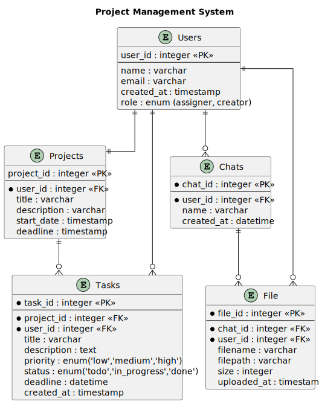
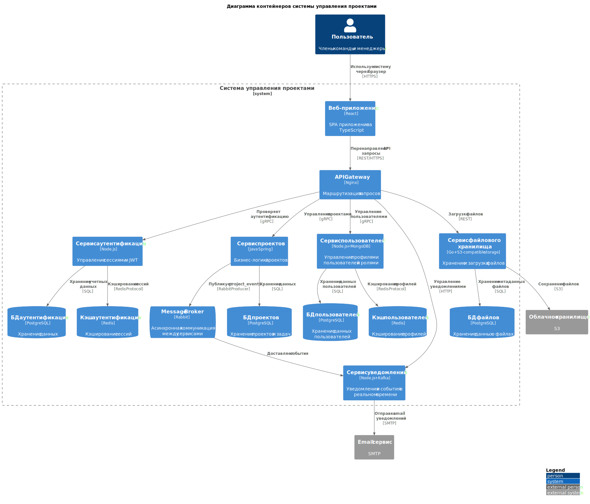
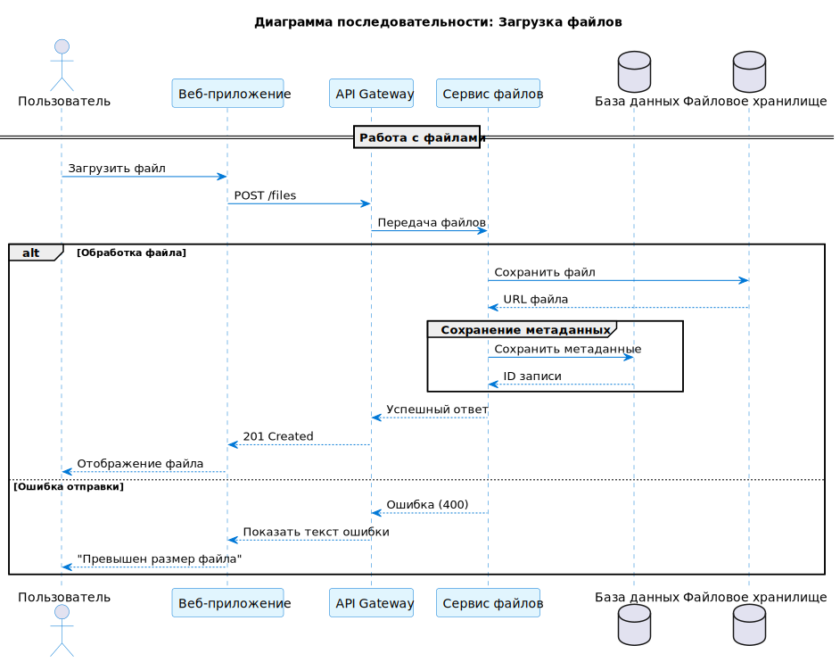
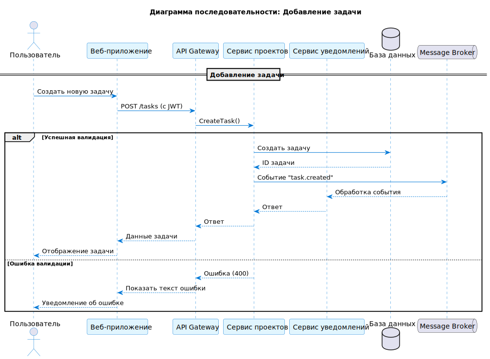

= Система управления проектами
==== Автор : Ксения

== Введение

В данном документе описывается система управления проектами и командной работы, которая представляет собой веб-платформу, обеспечивающую централизаванное управление задачами, проектами, коммуникацией и документооборотом в рамках команд.

== Заинтересованные стороны

[cols="1,2", options="header"]
|===
| Роль | Описание
| *Менеджеры проекта* | Контроль сроков, распределение задач, управление проектами
| *Аналитик* | Сбор требований, прототипирование макетов, ведение документации
| *Команда разработки* | Получение и разработка задач, участие в обсуждениях
| *DevOps* | Настройка, развертывание и мониторинг системы
| *Администратор* | Управление системой, назначение ролей
| *Тестировщик* | Проверка требований и соответствие поведения системы
| *Внешние клиенты* | Просмотр документации, обеспечение интеграций
|===

== Функциональные требования

[cols="1,1,2,4", options="header"]
|===
| ID | Категория | Требование | Описание
| FR1.1 | Управление пользователями | Регистрация | Система должна предоставлять возможность регистрироваться пользователям с использованием e-mail и пароля
| FR1.2 | Управление пользователями | Администрирование | Администраторы могут управлять пользователями (назначение ролей)
| FR2.1 | Управление проектами | Создание проекта | Система должна предоставлять возможность создания новых проектов с указанием названия, описания, сроков и ответственных
| FR2.2 | Управление проектами | Редактирование проекта | Система должна предоставлять доступ к редактированию проекта
| FR2.3 | Управление проектами | Управление командой | Пользователи с ролью администратор/менеджеров могут добавлять участников
| FR3.1 | Управление задачами | Создание задачи | Пользователи с ролью администратор/менеджер могут создавать задачи с указанием названия, описания, приоритета, дедлайна и ответственного
| FR3.2 | Управление задачами | Статусы задач | Поддержка статусов: "Назначена", "В работе", "Готово", "Отложена"
| FR3.3 | Управление задачами | Фильтрация | Фильтры по статусам, тегам, приоритету и ответственным
| FR5.1 | Коммуникация | Чат проекта | Система должна предоставлять возможность общения в встроенных чатах с историей сообщений
| FR6.1 | Файлы | Хранение | Загрузка и хранение файлов, привязанных к проектам/задачам
| FR6.2 | Файлы | Доступ | Скачивание файлов с контролем доступа
|===

== Нефункциональные требования

=== Архитектура
[cols="1,3", options="header"]
|===
| ID | Требование
| NFR1.1 | Система должна быть реализована на основе микросервисной архитектуры
|===

=== Производительность
[cols="1,3", options="header"]
|===
| ID | Требование
| NFR2.1 | Система должна обрабатывать запросы пользователей и выдавать результат не более чем через 3 секунды при нормальных условиях нагрузки
| NFR2.2 | Поддержка потоковой загрузки файлов до 1 ГБ
|===

=== Интерфейс и совместимость
[cols="1,3", options="header"]
|===
| ID | Требование
| NFR4.1 | Адаптивный и понятный интерфейс для быстрого освоения системы
| NFR4.2 | Система должна поддерживать русский и английский языки для расширения целевой аудитории
| NFR4.3 | Кроссбраузерная совместимость (Chrome, Firefox, Safari)
| NFR4.4 | Система должна быть интегрирована с внешними системами (рассылка уведомлений, видео-звонки)
|===

=== Надежность
[cols="1,3", options="header"]
|===
| ID | Требование
| NFR6.1 | Все функции должны иметь резервное копирование для быстрого восстановления при сбоях
|===

=== Безопасность
[cols="1,3", options="header"]
|===
| ID | Требование
| NFR7.1 | Система должна реализовывать механизмы аутентификации для повышения уровня безопасности
|===

=== Поддержка
[cols="1,3", options="header"]
|===
| ID | Требование
| NFR8.1 | Система должна регулярно обновляться с учетом отзывов пользователей
|===

== Диаграмма BPMN

== ER диаграмма

== Диаграммы С4

=== Диаграмма контейнеров

=== Контекстная диаграмма

== UML диаграммы

